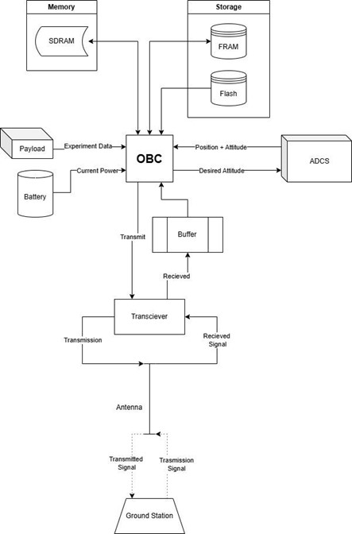
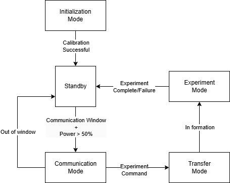
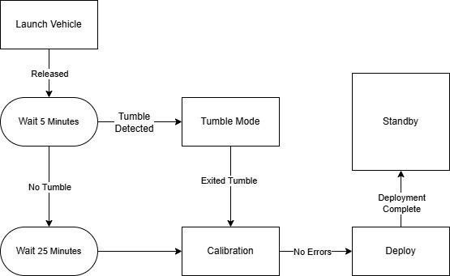
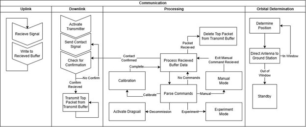
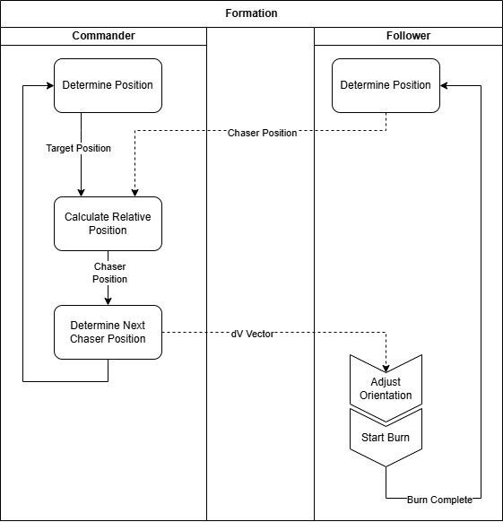
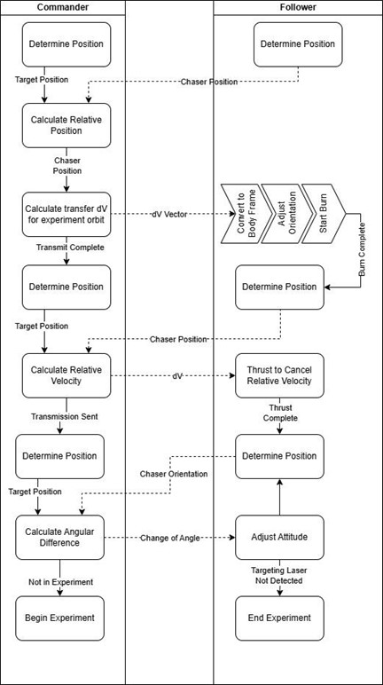

# Commands & Data

## Table of Contents

## Overview
The commands and data subsystem is responsible for the electronic architecture which coordinates and controls the satellite. The system stores data to be transmitted to the receiver on the ground and autonomously controls the craft based on onboard sensors and received commands. The satellite must be able to determine and adjust its attitude and direct power where necessary without commands from the ground. To ensure the systems will function within parameters, analytical and dynamic simulations will be run. The connections between electronic systems will be mapped and added below.
Several systems such as ADCS, thermal management, power, and the payload will produce data that will be stored on board until it can be transmitted to the ground station for analysis. This can be simulated by summing the data produced over a period as the craft goes through various modes where the amount of data changes. In the event the data storage on the satellite has reached capacity and it is unable to contact the ground, some data must be deleted. Determining what data is lost is based on its source, engineering data is likely to be less critical to the mission than the data from the payload. 
A state machine diagram is added to show how the satellite will respond to input to function autonomously. The craft must be able to calibrate internal systems and coordinate with the other satellite to stay in formation without control or input from the ground.

## Analysis Overview

## Connections System Diagram
To control the systems on board the satellite, the computer must be connected to each system to communicate data and commands. For systems onboard the satellite connections will be made using wires and pin connections.

The figure shows the data connections between the computer and other systems. The FRAM acts as the memory, storing data for short periods of time. Long term storage stores the data that will be transmitted in the SDRAM. The flash storage contains instructions and programs and is read-only, meaning the stored information will not be edited or deleted and no data is added. The power system measures the current amount of power stored in the battery. The ADCS system relays the current position and attitude of the satellite and the OBC provides the system with the desired attitude so the reaction wheels can adjust the craft to the correct orientation.

## Modes
In order to autonomously function the satellite must respond to sensor input and switch to the appropriate mode. A mode is the functionality of the satellite, with each mode determining how the satellite will operate and function. A table of different modes and the functions they perform along with the criteria required for the satellite to switch to the respective mode is shown below.
Table 3.4.1 - Modes
|Mode|Function|Criteria|
|--|--|--|
|Standby | - Monitors Sensors   - Checks for errors or corruption   - Maintains standby orbit | Default mode
| Communication | - Directs antenna toward ground station  - Transmits data  - Receives commands  |In Communication Window
|Transfer|- Finds position of other satellite - Moves satellite into position within parameters|CubeSats can successfully communicate|
|Experiment|- Directs satellite towards star  - Enter experiment orbit - Uses ADCS to keep payloads pointed at each other|Experiment command received

Once disconnected from the launch vehicle, the satellite will start in initialization mode before entering standby mode. A state machine diagram of the operation of the satellite is shown below. 

Standby mode monitors the onboard sensors, receives radio transmissions, directs solar panels to the sun, and constantly checks the position of the satellite in orbit. The position of the satellite in orbit is determined based on a Kalman analysis of the position given by the ADCS system. 

The CubeSat must wait until it is a safe distance from the launch vehicle before it checks onboard sensors for tumble. If tumble is detected the reaction wheels are used to attempt to exit tumble. If no tumble is detected the satellite waits to gain additional distance from the launch vehicle then begins calibration of the onboard sensors.
If the position of the satellite is within the communication window and the power stored in the battery is greater than half of its total capacity, the OBC switches to communication mode. Communication mode will direct the antenna toward the ground and power on the transmitter. Charging is placed before the communication mode so if the satellite is in sunlight the panels are directed towards the sun before the attitude is changed so the panels remain in as much light as possible, assuming the attitude will be adjusted along the shortest angle.

The downlink activates the transmitter and sends a signal to the ground station to confirm that communication is possible. If the satellite does not receive a signal from the ground station after a short period, another attempt to contact the ground station is made. This repeats until a signal confirming contact is received or the satellite exits the communication window. Once a confirmation from the ground has been received the first packet of data from the queue is transmitted. The satellite waits for a signal confirming the packet has been received and the data can be deleted from the OBC storage. This is repeated with the next packet on the queue, now the first packet. The queue is ordered based on importance to the mission; mission-critical information such as data produced by the experiment is given higher priority than engineering data, and will be placed higher in the queue and sent first.
The uplink, run in parallel with the downlink, monitors messages from the ground station, and sends the signal to the buffer for the OBC to process into commands. Processing reads the data from the receiving buffer and parses the output for commands. A command to start manual mode forces the satellite to act only based on received commands until a command is given to exit the mode. When the satellite has reached the end of its mission the decommission command activates the dragsail, causing the satellite to deorbit and burn up in the atmosphere.

## Inter-Satellite Coordination
The CubeSats must be in contact to function together and perform the experiment needed for this mission. The satellites will be in contact through radio transmissions of commands from a commanding satellite and data from a following satellite. The commander will transmit necessary commands to the follower when commanded by the ground station or when internal systems require coordination. During the communication mode the commander CubeSat will transmit to the ground and receive any commands. If data cannot be entirely stored on the commander, the follower will store the excess and transmit it to the commander as the commander data is deleted.

The commander determines the relative positions of each CubeSat then sends a command to direct the follower to the next point in the standby orbit. When the satellite receives the command to begin the experiment, the commander will send a command to the follower to change its orbit to get into a suitable position for the experiment.

From the new orbit a command is sent to the follower to match the velocity of the commander. Once the attitudes of the crafts are aligned, the experiment can begin. The follower directs starlight to the commander and the commander calculates any needed attitude adjustment. When the commander no longer detects the targeting laser the experiment is ended and the satellites return to standby mode. 

## Data Flow Schedule
The OBC uses a Flash storage drive to hold instructions for operation, and an FRAM to hold data before it is transmitted to the ground station. The data will be collected from the onboard sensors and transmitted to the ground station for analysis. Once the data is transmitted to the ground and the ground has confirmed it has received the packet, it can be deleted, freeing the space for new data. In the event the storage is full, the lowest packet on the queue is deleted. The ADCS system produces an average of 5 B/s which is saved to the OBC to be transmitted to the ground so the path of the orbit can be tracked. The temperature sensors produce roughly 15 B/s and the OBC log is estimated to write at 50 B/s as an average over the orbit. During the experiment, the payload will produce 10 kB/s for roughly 10 seconds. During the communication window the satellite will be able to communicate around 65 GB on average. The FRAM has 512 kB of storage available. This allows operations to run without filling the storage as long as the experiment is run once.